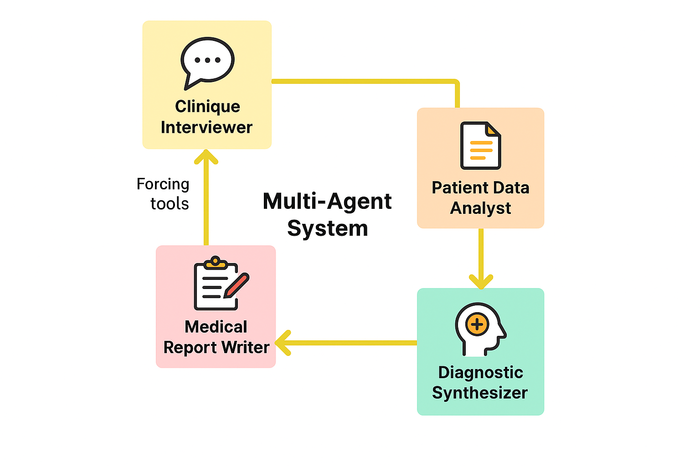

# PsyChat — Système d’entretien clinique assisté par IA et génération de rapport psychiatrique

## 1) Présentation du projet
PsyChat est une application assistant les professionnels de santé à conduire un entretien clinique structuré en 10 questions et à produire automatiquement un rapport psychiatrique PDF clair et professionnel.

Objectifs clés:
- Guider le patient au travers d’un entretien structuré (10 questions)
- Synthétiser les réponses et produire un rapport professionnel au format PDF
- Offrir une expérience rassurante et confidentielle, conforme aux bonnes pratiques
- Proposer une interface moderne (branding PsyChat) et un design minimaliste (2 couleurs)
## Architecture overview


## Démo vidéo

[](https://youtu.be/av04WHmX4us)


## 2) Pile technologique
- Frontend:
  - React + TypeScript (Vite)
  - Tailwind CSS (UI moderne, responsive)
- Backend:
  - Flask (Python) avec CORS
- Cadre IA:
  - CrewAI pour l’orchestration multi‑agents (entretien, analyse, synthèse, rédaction)
- Génération PDF:
  - ReportLab (mise en page professionnelle, logo, en‑tête/pied de page)
- Identité visuelle:
  - Logo PsyChat
  - Palette 2 couleurs: bleu `#2B6CB0` et gris très foncé `#111827`


## 3) Architecture multi‑agents (CrewAI)
PsyChat s’appuie sur un pipeline d’agents spécialisés orchestrés séquentiellement par CrewAI (voir `medical_report/src/medical_report/crew.py` et `config/*.yaml`).

Agents et rôles:
- interviewer_clinique: conduit l’entretien en 10 questions, collecte les réponses du patient
- analyste_clinique: structure les informations recueillies et établit un dossier synthétique
- synthetiseur_diagnostique: élabore des hypothèses/axes cliniques à partir des données
- redacteur_medical: rédige le rapport final clair et professionnel (markdown), prêt à être converti en PDF

Pourquoi le multi‑agent?
- Robustesse et clarté: chaque agent se concentre sur une compétence clinique spécifique
- Traçabilité: étapes distinctes et séquentielles (Process.sequential)
- Qualité: améliore la cohérence et la structure des résultats


## 4) API — Endpoints REST
Base locale (par défaut): `http://127.0.0.1:5001`

- POST `/start`
  - Démarre une nouvelle session d’entretien
  - Body JSON: `{ "topic": "Motif / sujet de consultation" }`
  - Réponse: `{ "session_id": string, "question": string }`

- POST `/chat`
  - Envoie la réponse du patient et reçoit la prochaine question
  - Body JSON: `{ "session_id": string, "answer": string }`
  - Réponse:
    - `{ "question": string }` tant que l’entretien n’est pas terminé
    - `{ "report": string, "session_id": string }` à la fin (markdown du rapport)

- GET `/download/{session_id}`
  - Télécharge le rapport PDF généré
  - Réponse: fichier `application/pdf`

- POST `/cleanup/{session_id}`
  - Supprime le fichier PDF temporaire et nettoie la session
  - Réponse: `{ "success": true }`

Exemples cURL:
```bash
# Démarrer une session
curl -X POST http://127.0.0.1:5001/start \
  -H "Content-Type: application/json" \
  -d '{"topic":"Anxiété et sommeil"}'

# Envoyer une réponse
curl -X POST http://127.0.0.1:5001/chat \
  -H "Content-Type: application/json" \
  -d '{"session_id":"<ID>","answer":"Réponse du patient"}'

# Télécharger le PDF
curl -L -o rapport.pdf http://127.0.0.1:5001/download/<ID>

# Nettoyer la session
curl -X POST http://127.0.0.1:5001/cleanup/<ID>
```


## 5) Fonctionnalités Frontend
- Interface simple, professionnelle, fidèle à la marque PsyChat (logo, palette)
- Chat temps réel pour l’entretien en 10 questions
- Message de complétion rassurant après la dernière question:
  - confirme la fin de l’entretien
  - informe du traitement des réponses pour générer le PDF
  - affiche une estimation courte avant d’afficher le bouton de téléchargement
  - réassure sur la confidentialité des informations
- Téléchargement du PDF en un clic
- Responsive et accessible (focus styles, contrastes, tailles de police)


## 6) Génération de rapport (PDF)
Le backend transforme le markdown produit par les agents en PDF professionnel via ReportLab (voir `medical_report/src/medical_report/pdf_generator.py`).

Caractéristiques du rendu:
- Nettoyage du markdown: retrait des placeholders (p. ex. `[À compléter]`), lignes système, doublons
- Mise en forme professionnelle:
  - Corps: 14pt (leading ~20)
  - Titres de section: 18pt
  - Titre principal: 24pt
- Multi‑pages: activé pour garantir la lisibilité
- Identité visuelle: logo PsyChat (en‑tête), ligne d’accent, deux couleurs
- Mentions de confidentialité en pied de page


## 7) Installation et exécution locale
Prérequis:
- Python 3.10+
- Node.js 18+
- npm ou yarn/pnpm

Cloner le dépôt:
```bash
git clone <url-du-repo>
```

Backend (Flask via crewAI):
```bash
# Créer/activer un environnement virtuel (recommandé)
python -m venv .venv
.venv\Scripts\Activate.ps1  # PowerShell (ou .venv\Scripts\activate.bat en CMD)

# Installer uv (gestion des dépendances) et crewAI
pip install uv

crewai install  

# Lancer le serveur web Flask via crewAI
crewai run  # démarre sur http://127.0.0.1:5001
```

Frontend (React/Vite):
```bash
cd medical_report/frontend
npm install
npm run dev  # http://127.0.0.1:5173
```

Configuration CORS (optionnelle, production):
- Backend: restreindre l’origine FRONTEND_ORIGIN
- Frontend: utilisez `VITE_API_BASE` pour pointer vers l’URL publique du backend

Exemple (Vite):
```bash
# Vercel / variables d’environnement
VITE_API_BASE=https://votre-backend.exemple.app
```

Dépannage:
- `Rapport PDF non disponible`: la génération a échoué; voir logs backend
- Télémetrie CrewAI timeout: inoffensif; peut être ignoré en local
- CORS: vérifier l’origine autorisée côté Flask et la variable `VITE_API_BASE` côté frontend


## 8) Sécurité & Confidentialité
- Les données de session sont temporaires (fichiers PDF supprimés après téléchargement via `/cleanup`)
- Les échanges sont limités à l’entretien clinique et au rapport; ne stockez aucune donnée sensible en dur
- En production, activez HTTPS et limitez strictement les origines CORS


## 9) Structure des dossiers (extrait)
```
medical/
└── medical_report/
    ├── app.py                      # API Flask
    ├── frontend/                   # Vite + React + Tailwind
    │   └── src/App.tsx            # Interface d’entretien + message de complétion
    └── src/medical_report/
        ├── crew.py                 # Orchestration CrewAI
        ├── pdf_generator.py        # Génération PDF (ReportLab)
        └── config/                 # agents.yaml, tasks.yaml
```


## 10) Ressources CrewAI (liens utiles)
- Site officiel: https://www.crewai.com/
- Documentation: https://docs.crewai.com/
- Dépôt GitHub: https://github.com/joaomdmoura/crewai
- Discord (communauté): https://discord.com/invite/X4JWnZnxPb


